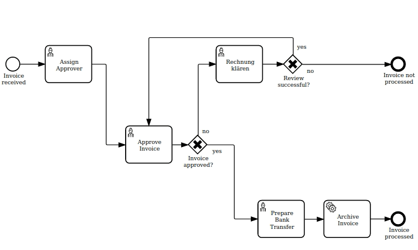

<h1 align="center">BPMN Visualization</h1>
<div align="center">
    <p align="center"> </p>
    <p align="center"> 
        <a href="https://npmjs.org/package/bpmn-visualization">
           
        </a> 
        <a href="https://github.com/process-analytics/bpmn-visualization-js/releases">
           
        </a> 
        <a href="https://cdn.statically.io/gh/process-analytics/bpmn-visualization-examples/master/examples/index.html">
           
        </a> 
        <a href="https://github.com/process-analytics/bpmn-visualization-js/actions">
           
        </a> 
        <a href="https://sonarcloud.io/dashboard?id=process-analytics_bpmn-visualization-js">
          
        </a>
        <a href="https://gitpod.io/#https://github.com/process-analytics/bpmn-visualization-js" target="_blank">
           
        </a> 
        <br>
        <a href="CONTRIBUTING.md">
           
        </a> 
        <a href="CODE_OF_CONDUCT.md">
           
        </a> 
        <a href="LICENSE">
           
        </a>
    </p>
</div>  
<br>

`bpmn-visualization` is a TypeScript library for visualizing process execution data on [BPMN](https://www.omg.org/spec/BPMN/2.0.2/) diagrams with:
- additional display options for execution data (highlight some transitions, counters, and more)
- interactive capacities (mouse hover, click)

<br>


## 🎮 Demo and examples

Please check the [__⏩ live environment__](https://cdn.statically.io/gh/process-analytics/bpmn-visualization-examples/master/examples/index.html).

You will find there basic usage as well as detailed examples showing possible rendering customizations.


## 🔆 Project Status

`bpmn-visualization` is actively developed and maintained.

Before the release of version `1.0.0`, there may be some breaking changes. We avoid these as much as possible, and carefully document them in the release notes.
As far as possible, we maintain compatibility for some minor versions.


## 🤩 Why using bpmn-visualization?

- ✨ True opensource license without watermark display
- ⚡️ Strong identity: the only BPMN viewer with a woman icon in the User Tasks
- 🎸 Fully documented and with a lot of integration examples
- 👓 Highly customizable rendering in a simple way
- 🔥 TypeScript support
- 🎯 Battle tested: high test coverage, thousands of tests, including tests on all supported browsers for Linux, macOS and Windows


## 🎨 Features

Already available features:
- [Supported BPMN Elements](https://process-analytics.github.io/bpmn-visualization-js/#supported-bpmn-elements).
- [Navigate through the BPMN diagram](https://process-analytics.github.io/bpmn-visualization-js/#diagram-navigation)
- [Display execution data with interactive capabilities](https://process-analytics.github.io/bpmn-visualization-js/#process_data)

Planned features:
- Additional BPMN styling capabilities
- Library extension points


## 🌏 Browsers Support

|  Chrome |  Firefox |  Safari |  Edge |
| :---------: | :---------: | :---------: | :---------: |
|  ✔️ |  ✔️ |  ✔️ |  ✔️ |

**Notes**:
- Chromium based browsers should work (automatic tests are run with Chromium canary releases). In particular, the following
browsers are known working with `bpmn-visualization@0.26.0`:
  - Brave 1.42.97
  - Chromium 104.0.5112.102
  - Opera 90.0.4480.54
- Support Chromium Edge but not Legacy Edge
- The library may work with the other browsers. They must at least support ES6.


## ♻️ Usage
The library is available from [NPM](https://npmjs.org/package/bpmn-visualization). \
We support various module formats such as:
- [IIFE](https://developer.mozilla.org/en-US/docs/Glossary/IIFE): `dist/bpmn-visualization.js`
- [ESM](https://dev.to/iggredible/what-the-heck-are-cjs-amd-umd-and-esm-ikm): `dist/bpmn-visualization.esm.js`
- [CommonJS](https://www.typescriptlang.org/docs/handbook/2/modules.html#commonjs): `dist/bpmn-visualization.cjs.js`
  

### 📌 Project usage

Install `bpmn-visualization` in the project:
```shell script
npm i bpmn-visualization
```

Then use this snippet to load your BPMN diagram in a page:
```javascript
import { BpmnVisualization } from 'bpmn-visualization';

let bpmnContent; // your BPMN 2.0 XML content
// initialize `bpmn-visualization` and load the BPMN diagram
// 'bpmn-container' is the id of the HTMLElement that renders the BPMN Diagram
const bpmnVisualization = new BpmnVisualization({ container: 'bpmn-container' });
bpmnVisualization.load(bpmnContent);
```

You can set the BPMN content using one of the following ways:
  * Copy/Paste directly the XML content in a variable
  * Load it from an url, like this [example](https://github.com/process-analytics/bpmn-visualization-examples/blob/master/examples/display-bpmn-diagram/load-remote-bpmn-diagrams/index.html)
  * Load from your computer, like the [demo example](https://github.com/process-analytics/bpmn-visualization-examples/tree/master/examples/display-bpmn-diagram/load-local-bpmn-diagrams/index.html)


#### 📜 TypeScript Support

The `bpmn-visualization` npm package includes type definitions, so the integration works out of the box in TypeScript projects.
`bpmn-visualization` requires **TypeScript 4.5** or greater.

ℹ️ If you are looking for examples of projects integrating `bpmn-visualization` with TypeScript, see the [bpmn-visualization-examples repository](https://github.com/process-analytics/bpmn-visualization-examples/#bpmn-visualization-usage-in-projects).

---
**NOTE**

Prior version 0.27.0, `bpmn-visualization` required extra configuration for TypeScript projects as explained in the [v0.26.2 README](https://github.com/process-analytics/bpmn-visualization-js/tree/v0.26.2#-typescript-support).

---


### 💠 Browser usage

In the HTML page:
   * Load `bpmn-visualization` (replace `{version}` by the recent version)
   * Define the container that displays the BPMN diagram, here _bpmn-container_
   * Load your BPMN diagram in a page
```html
<script src="https://cdn.jsdelivr.net/npm/bpmn-visualization@{version}/dist/bpmn-visualization.min.js"></script>
...
<div id="bpmn-container"></div>
...
<script>
  let bpmnContent; // your BPMN 2.0 XML content
  // initialize `bpmn-visualization` and load the BPMN diagram
  // 'bpmn-container' is the id of the HTMLElement that renders the BPMN Diagram
  const bpmnVisualization = new bpmnvisu.BpmnVisualization({ container: 'bpmn-container'});
  bpmnVisualization.load(bpmnContent);
</script>
```


### 👤 User documentation
The User documentation (with the feature list & the public API) is available in the [documentation site](https://process-analytics.github.io/bpmn-visualization-js/).


### ⚒️ More

💡 Want to know more about `bpmn-visualization` usage and extensibility? Have a look at the
[__⏩ live examples site__](https://cdn.statically.io/gh/process-analytics/bpmn-visualization-examples/master/examples/index.html).

For more technical details and how-to, go to the [bpmn-visualization-examples](https://github.com/process-analytics/bpmn-visualization-examples/)
repository.


## 🔧 Contributing

To contribute to `bpmn-visualization`, fork and clone this repository locally and commit your code on a separate branch.  
Please write tests for your code before opening a pull-request:

```sh
npm run test  # run all unit & e2e tests
```

You can find more detail in our [Contributing guide](CONTRIBUTING.md). Participation in this open source project is subject to a [Code of Conduct](CODE_OF_CONDUCT.md).

✨ A BIG thanks to all our contributors 🙂


## 📃 License

`bpmn-visualization` is released under the [Apache 2.0](LICENSE) license.  
Copyright &copy; 2020-present, Bonitasoft S.A.

Some BPMN icons used by `bpmn-visualization` are derived from existing projects. See the [BPMN Support documentation](https://process-analytics.github.io/bpmn-visualization-js/#supported-bpmn-elements)
for more details:
- [draw.io](https://github.com/jgraph/drawio) (Apache-2.0)
- [flaticon](https://www.flaticon.com) ([freepikcompany license](https://www.freepikcompany.com/legal#nav-flaticon))
- [noun project](https://thenounproject.com/) (mainly Creative Commons CCBY 3.0)


## ⚡ Powered by

[](https://statically.io)

**[statically.io](https://statically.io)** (<kbd>demo</kbd> and <kbd>examples</kbd> live environments)


**[surge.sh](https://surge.sh)** (<kbd>demo</kbd> and <kbd>documentation</kbd> preview environments)


[demo-live-environment]: https://cdn.statically.io/gh/process-analytics/bpmn-visualization-examples/master/demo/index.html
