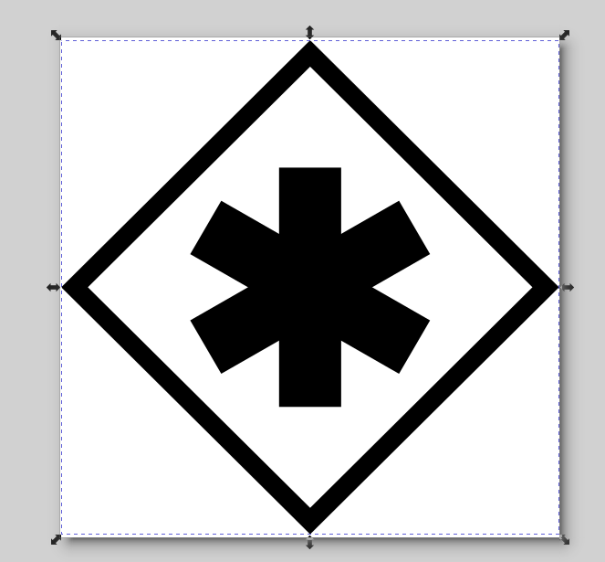

# BPMN Support - How To

## Introduction

We manage the BPMN Support very incrementally as we prefer small changes, because they are easier and faster to review
and less risky.

So we proceed using several steps:
- `detection`:
  - First, being able to extract the BPMN elements from the BPMN source
  - Then, being able to display BPMN elements in an arbitrary form
  - This ensures that the whole infrastructure is put in place for the newly introduced elements support, from parsing to rendering,
  and that tests have been added or updated.
- `rendering`: 
  - We set up the BPMN shape, styles, icons 
  - We polish the display

On the development flow side, this means that there is at least one Pull Request for the `detection` and another one for the `rendering`.

Remember that we prefer small changes . So, `detection` can be split into several Pull Requests to cover
various aspects of the BPMN elements. \
For instance:
- For a `Pool`, first detect horizontal elements, then vertical elements.
- For a given `BPMN Event` (let's say `Signal`), we have a detection issue for start, catch, throw, ...


## Elements detection

Overview of tasks to be achieved:
* Update the BPMN model if the BPMN element is not already defined
* Update the json parsing to store the new element in the BPMN model
* Use an arbitrary rendering for the BPMN element
* Add/Update tests
* Update the BPMN support documentation: add the element with the [experimental icon](../users/bpmn-support.adoc)

Refer to existing Pull Requests to have a better view about the work to do, for instance:
- [Detect Complex Gateway Pull Request](https://github.com/process-analytics/bpmn-visualization-js/pull/2250/files)
- [Detect and Render Group Pull Request](https://github.com/process-analytics/bpmn-visualization-js/pull/1462/files)
- [Detect call activities calling different global tasks Pull Request](https://github.com/process-analytics/bpmn-visualization-js/pull/1447/files)

### BPMN model update

When changing the model, the image representing the model in the documentation needs to be updated as well.

The documentation uses the SVG image produced from draw.io file.
This file is stored [here](../users/architecture/images/architecture/internal-model.drawio).

To update the model
- edit [internal-model.drawio](../users/architecture/images/architecture/internal-model.drawio) with https://app.diagrams.net or with the `diagrams.net` desktop application
- store the modified file in the repository 
- don't forget to export it as SVG and store it in [the repository](../users/architecture/images/architecture/internal-model.svg) as well


### What to change?

Except for special container elements like `Pool`, `Lane` and `Subprocess`, detecting a new BPMN element only requires to
add a new value in the `ShapeBpmnElementKind` enum.

The `ProcessConverter` uses the `ShapeBpmnElementKind` values to detect elements in the BPMN source.

### Elements requiring special attention 

- For BPMN Events, the actual type in controlled by `EventDefinition` fields in the BPMN specification. Detecting new event
types requires changes in `ShapeBpmnEventDefinitionKind` to add the newly supported BPMN Event Definition.
- For BPMN SubProcesses, the actual type is controlled by `ShapeBpmnSubProcessKind` which is set accordingly during the BPMN parsing.

### Initial Shape Rendering

Overview:
* The work to do depends on the BPMN types (events and tasks)
* Add a new `mxGraph` shape for totally new elements (see architecture)
* Use an arbitrary color to fill the new BPMN element
  * Purpose: uniquely identify a BPMN element on the BPMN diagram even if the rendering is not implemented.
  * This is directly managed in the BPMN mxGraph shape class
* Refer to provided examples above for more details


### Tests for elements detection 

**IMPORTANT**: **_Please first refer to the [testing documentation](testing.md) for a clear view of the testing strategy_** 


#### Unit tests

* Add json parsing tests related to the new BPMN element to ensure that the parser is able to make it available to the
`ProcessConverter`. The convention is to have a test file per BPMN element, please follow the existing file name scheme.
  * If you want to use a given BPMN xml diagram as input for the test, you can use an utils script to generate the json representation.
  See [the dedicated README](../../scripts/utils/README.md) file.
* Depending on the BPMN element, you may also have to add tests about `default sequence flow` and/or `conditional sequence
flow` support (see `ShapeBpmnElementKind` for more details)
* No need to create specific XML parsing tests. The XML parsing is tested globally using BPMN files for various BPMN vendors.
* The `mxGraph` style for the shape must be tested as well, see `StyleComputer` test

#### Integration tests

* Update model test, mainly to ensure that the new BPMN element is now stored in the `mxGraph model`, see `mxGraph.model.bpmn.elements.test.ts`.
* Fixtures bpmn diagrams used by model tests:
  * Name starts with `model-`
  * Generally, update the `test/fixtures/model-complete-semantic.bpmn` file with the newly introduced file and update the model expectation accordingly. \
    See this Pull Request as example: [[FEAT] Detect Business rule task](https://github.com/process-analytics/bpmn-visualization-js/pull/669/files#diff-ba360f5636b87293c740da307c4ec30c3aa5e8824ffa02e549a78dc8e0113320)
    * Add corresponding **Semantic** section
    * Add corresponding **Diagram** section 
    * Please, adjust shape coordinates to ensure new elements can be easily shown with a viewer and don't overlap with existing elements
  * For special cases, a dedicated test using a specific file. Please communicate with the Core Development Team if you think you need a dedicated file.

💡 If you have a format problem with the BPMN file of the test, the easier way to find the error & fix it is to load the file in your favorite BPMN editor. \
But be careful, all the BPMN vendors don't support all the BPMN elements and not the same. \
So before committing the modification, verify that some elements/configuration are not deleted.

#### End-to-end - Visual testing

* Sometimes the new BPMN element already exists in the test BPMN diagram, so it will be rendered and test will fail. In that case, update the reference snapshot.
* Otherwise, add the new element (follow practices described in the [testing documentation](./testing.md))


## Elements rendering

Overview of tasks to be achieved:
- Choose the [icon for the BPMN Element](#choose-bpmn-icon)
- Add/Update visual tests
- Update the BPMN support documentation: add the element with an [early access icon](../users/bpmn-support.adoc) and include a [snapshot of the icon in the documentation](#icon-in-documentation)

Refer to existing Pull Requests to have a better view about the work to do, for instance:
- [Error Event Rendering Pull Request](https://github.com/process-analytics/bpmn-visualization-js/pull/505/files)
- [Message Flow with initiating & non-initiating message Rendering Pull Request](https://github.com/process-analytics/bpmn-visualization-js/pull/569/files)


#### <a name="choose-bpmn-icon"></a> Choosing the final icon of the BPMN element

⚠️**Before starting the implementation**, please discuss with other contributors to ensure everybody agrees.
The final decision must be written in the GitHub number to keep track of the history.

##### Using an original icon

We are very happy to include your original work in `bpmn-visualization`. 

##### Integrating an existing icon

If you integrate an icon that you have not designed by yourself, please don't forget to credit its author and reproduction
conditions. Please try to use materials covered by a **Free License** to avoid any license compliance issues.

In that case, you must add credit in the following docs:
- In the source code
- In the BPMN support documentation: at the same place or close to the BPMN supported element
- In the main README: we don't list all icons there, but we reference projects where the icons come from

Here is a list of sites that you can use to choose an existing icon:
- [Bootstrap Icons](https://icons.getbootstrap.com/)
- [flaticon](https://www.flaticon.com)
- [Font Awesome Icons](https://fontawesome.com/icons)
- [freepik](https://www.freepik.com)
- [Google fonts](https://fonts.google.com/icons) (material symbol and material fonts). Please check the [license](https://developers.google.com/fonts/faq).
- [ionicons](https://ionic.io/ionicons)
- [iconify](https://iconify.design/)
- [Noun Project](https://thenounproject.com)
- [Octicons](https://primer.style/octicons/)
- [SVG Repo](https://www.svgrepo.com/)
- ......

[draw.io](https://github.com/jgraph/drawio) provides [BPMN shapes](https://github.com/jgraph/drawio/blob/v20.5.0/src/main/webapp/shapes/bpmn/mxBpmnShape2.js) that can be directly included in `bpmn-visualization` by adapting the JavaScript code into Typescript.
It also includes [mxGraph stencils](https://github.com/jgraph/drawio/blob/v20.5.0/src/main/webapp/stencils/bpmn.xml) that can be reused. In this case, they have to be transformed in to TypeScript code. See below for more information.


### BPMN icon and marker tips

The icon and markers of the BPMN elements must be defined in the mxGraph custom shapes and this currently must be done using
`TypeScript` code. The `IconPainter` class manages all icons rendering/painting.  

It is possible to adapt an SVG icon or an `mxGraph` stencil thanks to [mxgraph-svg2shape](https://github.com/process-analytics/mxgraph-svg2shape),
a Java tool that will let you transform this content (in a file) into a set of `TypeScript` commands.

Please be aware that the tool is not able to support all SVG files, and you may need to adapt the SVG definition prior the
tool can transform it. See [PR #210](https://github.com/process-analytics/bpmn-visualization-js/pull/210) for instance.


#### Integration Example

Let's say we want to use this SVG content as an icon or marker:


 ```xml
<svg width="250" height="350" version="1.1" xmlns="http://www.w3.org/2000/svg">
    <path d="M20,230 Q40,205 50,230 T90,230" fill="none" stroke="blue" stroke-width="5"/>
</svg>
```

Running the `Svg2Js` CLI, this will produce something like:
```typescript
// shape: path-blue
// width: 70
// height: 50
// foreground
canvas.begin();
canvas.moveTo(0, 25);
canvas.quadTo(20, 0, 30, 25);
canvas.quadTo(40, 50, 70, 25);
canvas.stroke();
```

Then you can directly use the produced code in the `IconPainter` functions.

The height and width in the comments should be used as original icon size when creating the `canvas` instance like in
the following. The values may differ from the svg viewport as `Svg2Js` resize the SVG source.
```typescript
const originalIconSize = { width: 70, height: 50 };
const canvas = this.newBpmnCanvas(paintParameter, originalIconSize);
```

**Note**: The canvas used in the `IconPainter` may not support all mxGraph drawing functions. In that case, please open
a Pull Request, or an Issue to add the missing functions. 


### Tests for elements rendering

All tests should have been introduced during the detection phase. Please review there is no missing tests.

Visual tests introduced when adding the detection support should fail for the BPMN Element after the rendering has changed. \
Please update the reference snapshot image accordingly.


### <a name="icon-in-documentation"></a> Integrate the BPMN element icon in the documentation

Here are some tips to generate the SVG to be included in the documentation.

- Take the BPMN diagram used to test the related BPMN element in visual tests
- Load the diagram in a test page.
- With your browser DevTools, inspect the element and retrieve the related SVG group
- Copy the retrieved SVG code in a file and wrap it in a SVG element as shown below:

```SVG
  <svg viewBox="0 0 158.485 158.485" width="96" height="96" xmlns="http://www.w3.org/2000/svg">
      <!-- the retreieved SVG code -->
  </svg>
```
- Open the file in a SVG Editor (Inkscape for instance). 
- You may need to resize the screen if the SVG icon is placed outside the viowBox as shown below:


- Re-position and adjust the dimension of the SVG, so that it fits the viewBox as shown below:



- Save
- Eventually clean the SVG with tools like SVGGO: https://jakearchibald.github.io/svgomg/
