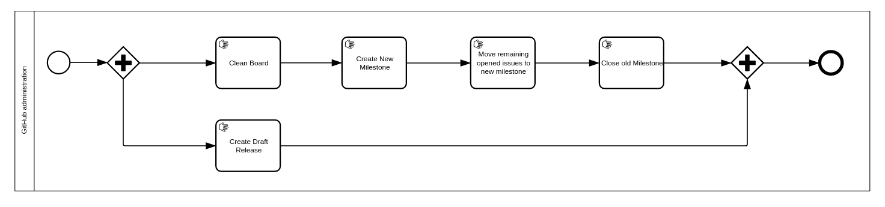
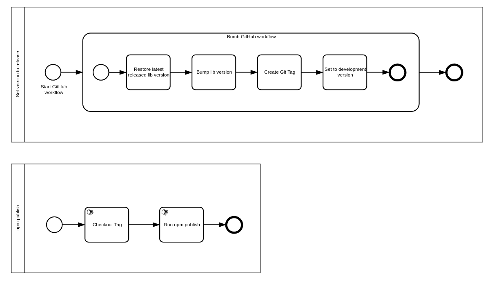
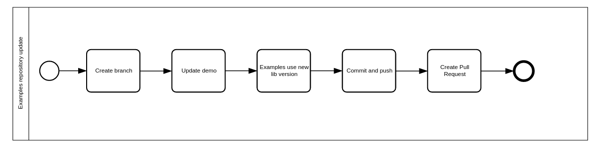

# Maintainers

## Merging a PR (maintainers only)

A PR can only be merged into master by a maintainer, if all of these conditions are met:

* It is passing CI.
* It has been approved by at least two maintainers. If it was a maintainer who opened the PR, only one extra approval is needed.
* It has no requested changes.
* It is up to date with current master.

## Release (maintainers only)

Maintainers need to do the manual following actions **in the order described here** to push out a release (the release
automation is a work in progress).

### Issues and milestones update

Milestone names are based on the lib version
- Clean the opened milestone if some issues are still opened (move them to a new one or discard milestone from them)
- Close the milestone
- Clean the [Day to Day Board](https://github.com/process-analytics/bpmn-visualization-js/projects/1): archive all cards
of the `Done` column related to the milestone

#### Publish new version

#### Git Tag

- Open [github actions](https://github.com/process-analytics/bpmn-visualization-js/actions?query=workflow%3ARelease)
- Click on the 'Run workflow' dropdown located on the right side of the page
- Provide parameter value for New version type (default is patch, but you can choose one of the [new-version | major | minor | patch])
- Click on the button 'Run workflow'
- Make sure job execution was successful by checking the status
- If everything went well you can see new tag created

#### NPM publish new version
- Pull the new version created by the release workflow: `git pull origin`
- Ensure you are on the last tag locally: `git checkout vX.Y.Z`
- Run `npm publish` to make the new version available to the community (you can pass --dry-run to validate the command prior publishing)

### GitHub update

- Ensure the latest closed milestone matches the name of the tag/version that has just been pushed. Renamed it if needed
- GitHub release
  - Open [github releases](https://github.com/process-analytics/bpmn-visualization-js/releases)
  - Create a new draft release and name it `Next` (the name is not relevant and will be replaced automatically later).
  This ensures that development can continue without impacting the writing of the content of the in progress release. That way,
  if a PR is merged, `release-drafter` will update the `Next` draft release keeping the in-progress release untouched.
  - The draft release for the newly tagged version should already exist:
    - [release-drafter](https://github.com/release-drafter/release-drafter) creates or updates draft release for the
    next version each time a pull request is merged to the `master` branch.
    - create a new release if it is missing or rename the existing one to match .
  - Assign the new tag as release target and save the draft (this should have already been managed by `release-drafter`)
  - Ensure that `This is a pre-release` is unchecked (except if we are releasing alpha, beta, rc, ...)
  - In the release description (check previous releases as a source of inspiration)
    - at least add/update a link to the related milestone
    - put screenshots/gif of the new features
  - Published the release **only when you are done** with the release content. At any time, you can save the draft

## bpmn-visualization-examples repository update

A Pull Request is created automatically with the following changes:
- The old demo is replaced by the new.
- The BPMN Visualization version, in the examples, is replaced by the new version of the library.

If, for some reasons, the Pull Request is not created, you can execute manually the [Update BPMN Visualization version](https://github.com/process-analytics/bpmn-visualization-examples/actions/workflows/update_bpmn_visualization_version.yml) job. \
If it is still not created, you can follow the next steps:

⚠️⚠️⚠️ _**Only if the job to create the Pull Request and update the demo & the examples does NOT work!**_  ⚠️⚠️⚠️

### Demo environment update
Make the new version available for demo.

- The `Upload` GitHub workflow has built the demo for the new tag, so download the demo artifact directly from the  Actions section on GitHub.
- Alternatively, if the artifact is not available via GitHub Actions, you can build it locally.
  - Checkout the git tag related to the new version.
  - Run `npm run demo` which generates it in the `dist` folder.
- Create a new branch in the [bpmn-visualization-examples](https://github.com/process-analytics/bpmn-visualization-examples/demo) repository and add the new demo content (proceed how it has been done for prior versions). 
- Push to GitHub and create a new Pull Request.

### Examples update
**Note**: do this using the Pull Request you have just created for the demo update

- Make the examples use the latest version of the lib. A bash script is available to help you for this task in the `scripts` folder.
- Tests that the examples work with the new lib version.
- If temporary version of the lib has been commited (generally in the demo folder) to make examples use it prior availability on npmjs, delete the corresponding file and update the examples.

⚠️⚠️⚠️ _**End of the manual steps**_ ⚠️⚠️⚠️

### Tagging
When all updates have been completed, merge the Pull Request created above.

To create the tag, the easiest way is to create a new release by following the [GitHub help](https://help.github.com/en/github/administering-a-repository/managing-releases-in-a-repository#creating-a-release)
- for `Tag version`, use a value that is the same as the lib. The tag will be created when the release will be published
- for `Target`
  - usually, keep the `master` branch except if new commits that you don't want to integrate for the release are already
  available in the branch
  - in that case, choose a dedicated commit 
  - **important**: ensure that the build is passing on the chosen branch or commit used to create the release

Alternatively, you can create the tag from your local machine and then push it.

## Communicate about the release

### Twitter

You can use this template:

> 📣 BPMN Visualization {version} is out! 🎉
>
> ===> some short description here <===
>
> #bpmnvisualization #bpmn #visualization #typescript #opensource
>
> https://github.com/process-analytics/bpmn-visualization-js/releases/tag/v{version}

