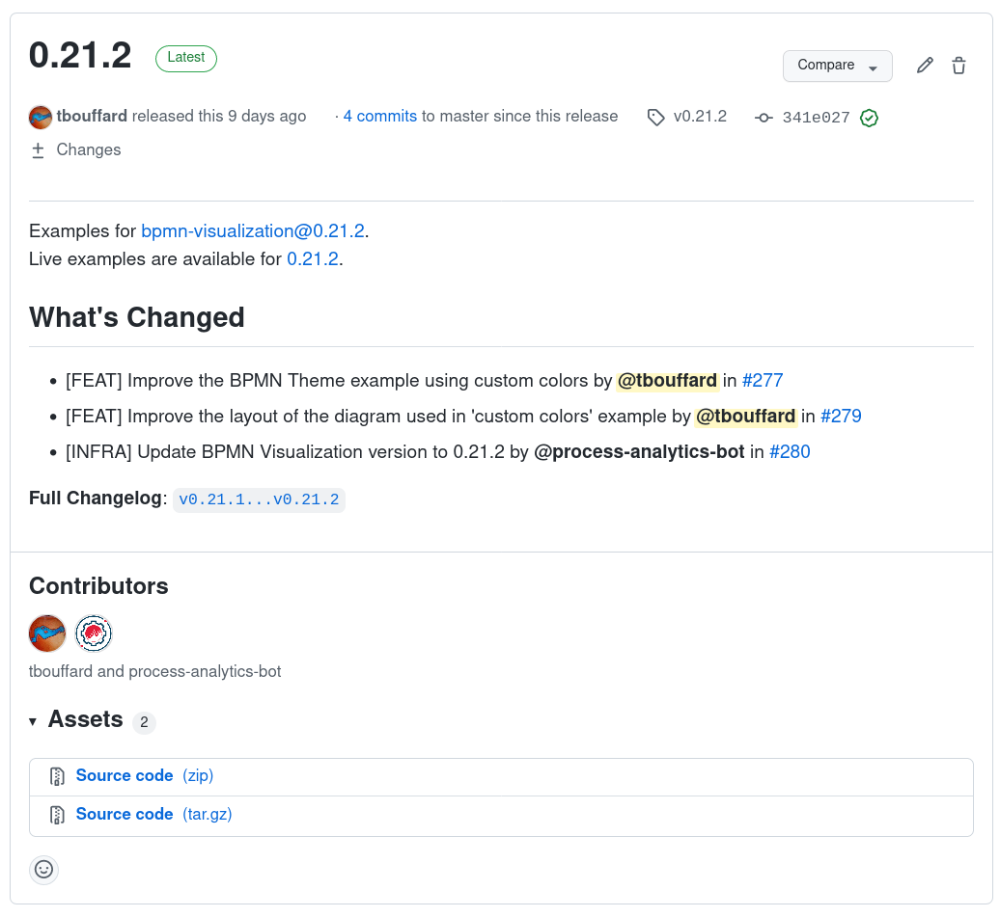

# Maintainers

## Merging a Pull Request

A Pull Request (referred as PR in the rest of this documentation) should only be merged into the `master` branch by a maintainer, if all
of these conditions are met:
- All Checks are green.
- It has been approved by at least two maintainers. If it was a maintainer who opened the PR, only one approval is needed.
- It has no requested changes.
- It is up to date with the `master` branch.

## Release process

Maintainers need to perform the following actions **in the order described here** to push out a release. Most of the actions
are automated once the release is triggered but manual actions are required for:
- Documentation and communication
- GitHub repository management (the automation is a work in progress).

### Publish `bpmn-visualization` new version

#### Overview

#### Prepare the GitHub Release

- Open [github releases](https://github.com/process-analytics/bpmn-visualization-js/releases)
- A draft release for the version to be released should already exist:
  - [release-drafter](https://github.com/release-drafter/release-drafter) creates or updates draft release for the
  next version each time a pull request is merged to the `master` branch.
  - Rename the existing draft release to `In Progress`. The name is not relevant and will be later used to identify the draft release to update.
  - If an old `Notes for next release notes` exists, put its content in the `In Progress` release to later help to write the details. Then, delete this release.
- Create a new draft release and name it `Notes for next release notes`. It will be used during development to note important things and prepare
  the content of the next release notes.
- Create a new draft release and name it `Next` (the name is not relevant and will be replaced automatically later).
  This ensures that development can continue without impacting the writing of the content of the `In Progress` release. That way,
  if a PR is merged, `release-drafter` will update the `Next` draft release keeping the `In Progress` release untouched.

#### Set the release version and create a git tag

**Note:** This step triggers the release automation process.

- Open [github actions](https://github.com/process-analytics/bpmn-visualization-js/actions/workflows/release.yml)
- Click on the 'Run workflow' dropdown located on the right side of the page
- Provide parameter value for New version type (default is patch, but you can choose one of the [new-version | major | minor | patch])
- Click on the button 'Run workflow'
- Make sure job execution was successful by checking the status
- The new git tag should have been created and available on GitHub

#### Publish the new version on npm.js

A GitHub job is run at git tag creation, so the publishing should be done automatically.

___
##### Manual procedure

⚠️⚠️⚠️ _**Only if the GitHub job that publish the npm package fails after manual re-run!**_  ⚠️⚠️⚠️

- Pull the new version created by the release workflow: `git pull origin`
- Ensure you are on the last tag locally: `git checkout vX.Y.Z`
- Run `npm publish` to make the new version available to the community (you can pass --dry-run to validate the command prior publishing)
___

### GitHub issues, milestones and projects update

**Note:** we always put issues related to a version in a Milestone whose name matches the version.

- Ensure the name of the milestone used for the new release version matches the name of the tag/version that has just been pushed. Renamed it if needed.
- Clean this opened milestone if some issues are still opened (move them to a new one or discard milestone from them)
- Close the milestone
- Clean the [Day to Day Board](https://github.com/process-analytics/bpmn-visualization-js/projects/1): archive all cards
  of the `Done` column related to the milestone

### Continue filling the GitHub Release

- Open [github releases](https://github.com/process-analytics/bpmn-visualization-js/releases)
- Rename the existing `In Progress` draft release (updated before starting the release) to match the version that has just been tagged
- Ensure that `This is a pre-release` is unchecked (except if we are releasing alpha, beta, rc, ...)
- In the release description (check previous releases as a source of inspiration)
  - at least add/update a link to the related milestone
  - put screenshots/gif of the new features
- Assign the new tag as release target and save the draft (this may have been already managed by `release-drafter`). **Do it only just before
publishing** especially if you update an already set tag for minor version. Once you change the tag and save, the update date of the release
is updated making it the newest one. This is the one that is updated by release-drafter so there is a risk to loose the whole content of
the release notes.
- Publish the release **only when you are done** with the release content. At any time, you can save the draft

### bpmn-visualization-examples repository update

A Pull Request is created automatically (at git tag creation in the `bpmn-visualization` repository) with the following changes:
- The old demo is replaced by the new.
- The BPMN Visualization version, in the examples, is replaced by the new version of the library.

See the [Release Overview](#overview) for the big picture.

If, for some reasons, the Pull Request is not created, 
- first check that the [Update BPMN Visualization version](https://github.com/process-analytics/bpmn-visualization-examples/actions/workflows/update_bpmn_visualization_version.yml) action
has run, and if it failed, re-run the jobs
- otherwise, you can execute manually the [Update BPMN Visualization version](https://github.com/process-analytics/bpmn-visualization-examples/actions/workflows/update_bpmn_visualization_version.yml) job.

If it is still not created, you can follow the manual procedure described below.

#### Manual procedure

___
⚠️⚠️⚠️ _**Only if the job to create the Pull Request and update the demo & the examples does NOT work!**_  ⚠️⚠️⚠️

##### Demo environment update
Make the new version available for demo.

- The `Upload` GitHub workflow has built the demo for the new tag, so download the demo artifact directly from the  Actions section on GitHub.
- Alternatively, if the artifact is not available via GitHub Actions, you can build it locally.
  - Checkout the git tag related to the new version.
  - Run `npm run demo` which generates it in the `dist` folder.
- Create a new branch in the [bpmn-visualization-examples](https://github.com/process-analytics/bpmn-visualization-examples/demo) repository and add the new demo content (proceed how it has been done for prior versions). 
- Push to GitHub and create a new Pull Request.

##### Examples update
**Note**: do this using the Pull Request you have just created for the demo update

- Make the examples use the latest version of the lib. A bash script is available to help you for this task in the `scripts` folder.
- Tests that the examples work with the new lib version.
- If temporary version of the lib has been commited (generally in the demo folder) to make examples use it prior availability on npmjs, delete the corresponding file and update the examples.

⚠️⚠️⚠️ _**End of the manual steps**_ ⚠️⚠️⚠️
___

#### Update examples running in live IDE

In case of important fixes or features in the new release, you can update the examples running on CodeSandbox and CodePen.

For the detailled list of available examples, please check the [examples home page](https://cdn.statically.io/gh/process-analytics/bpmn-visualization-examples/master/examples/index.html#miscellaneous).

#### Mark `bpmn-visualization-examples` as released
When all updates have been completed, merge the Pull Request created above.

Create a new GitHub release by following the [GitHub help](https://help.github.com/en/github/administering-a-repository/managing-releases-in-a-repository#creating-a-release)
- for `Tag version`, use a value that is the **same as the lib in the vX.Y.Z form**. The git tag will be created when the release will be published.
- for `Target`
  - usually, keep the `master` branch except if new commits that you don't want to integrate for the release are already
  available in the branch
  - in that case, choose a dedicated commit 
  - **important**: ensure that the build is passing on the chosen branch or commit used to create the release
- Description
  - add a link to the bpmn-visualization related release
  - add a link to the live environment for the related tag
  - make GitHub generates the [release notes automatically](https://docs.github.com/en/repositories/releasing-projects-on-github/automatically-generated-release-notes)

You should have something like in release [v0.21.2](https://github.com/process-analytics/bpmn-visualization-examples/releases/tag/v0.21.2)

___
⚠️⚠️⚠️ _**Only if the [notification](https://github.com/process-analytics/bpmn-visualization-js/actions/runs/2191000065) does NOT work!**_  ⚠️⚠️⚠️

##### Notify [BPMN Visualization - R package](https://github.com/process-analytics/bpmn-visualization-R) repository of the new release

Follow the documentation of the [BPMN Visualization - R package](https://github.com/process-analytics/bpmn-visualization-R/blob/main/CONTRIBUTING.md#bpmn-visualization-js-update) to update the BPMN Visualization dependency with the new release.

⚠️⚠️⚠️ _**End of the manual steps**_ ⚠️⚠️⚠️
___

## Communicate about the release

### Twitter

You can use this template:

> 📣 bpmn-visualization {version} is out! 🎉
>
> ===> some short description here <===
>
> #bpmnvisualization #bpmn #visualization #typescript #opensource
>
> https://github.com/process-analytics/bpmn-visualization-js/releases/tag/v{version}

### Discord

Channel: [news](https://discord.com/channels/1011911769607913562/1024329159033499780)

You can use this template:

> 📣 bpmn-visualization {version} is out! 🎉
>
> ===> some short description here <===
>
> https://github.com/process-analytics/bpmn-visualization-js/releases/tag/v{version}

