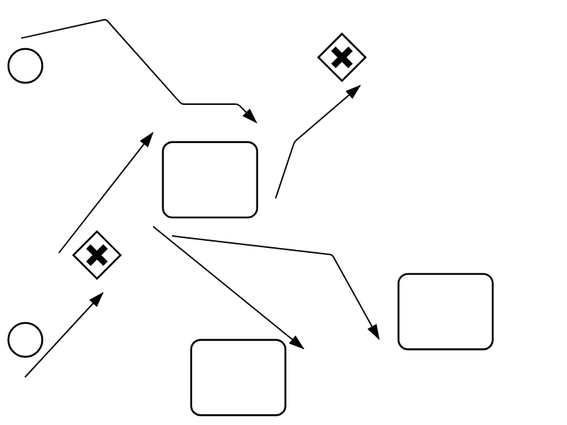

# mxGraph Integration

The [mxGraph](https://jgraph.github.io/mxgraph/) integration is in charge of displaying the BPMN diagrams, by filling the
[mxGraph model](https://jgraph.github.io/mxgraph/docs/manual.html#3.1.1) from the BPMN model.

If you are new to `mxGraph` or want to know more about it, please have a look at the [mxGraph tutorial](https://jgraph.github.io/mxgraph/docs/tutorial.html)
and [mxGraph manual](https://jgraph.github.io/mxgraph/docs/manual.html).

## Logical Groups of BPMN Elements

[mxGraph Group Structure](https://jgraph.github.io/mxgraph/docs/manual.html#3.1.4) allows to define a parent-child relationship
that leverages various rendering features like collapsing/expanding, layering, drill down, group move/hide, ...
See [mxGraph Complexity Management](https://jgraph.github.io/mxgraph/docs/manual.html#3.1.5) for more details.

On `mxGraph` graph creation, the `bpmn-visualization` fills the following group of BPMN elements:
- `pool` is the parent of `lanes` and `inter-lane elements` (for instance, `sequence flows`), or any BPMN elements when there is no `lane`
- `lane` is the parent of elements it includes in the BPMN source

The default mxGraph parent is the parent of

* inter pool elements (for instance, `message flows`)
* elements when the BPMN source doesn't define any lane/pool

## BPMN elements positioning

*Note*: the following applies to both BPMN shapes and edges (including waypoints)

The bpmn input source coordinates are absolute whereas mxgraph uses coordinates in the referential of the parent cell.
As we define a parent-child relationship when inserting BPMN elements in the mxGraph model, a coordinate transformation
layer is required. See [BpmnRenderer](../../src/component/mxgraph/BpmnRenderer.ts) for more details.

## BPMN Elements rendering and style

Each BPMN Element is transformed into a `mxGraph` [mxCell](https://jgraph.github.io/mxgraph/docs/manual.html#3.1.3.4) and then inserted into the `mxGraph` model:
- `vertex` for BPMN Shapes
- `edge` for BPMN Edges

At insertion, a style is passed to configure how the BPMN Element is rendered.

The [style](https://jgraph.github.io/mxgraph/docs/js-api/files/view/mxStylesheet-js.html) (see also the [mxGraph manual](https://jgraph.github.io/mxgraph/docs/manual.html#3.1.3.1))
is defined and registered in `StyleConfigurator`. In particular, it refers to the name of a [mxShape](https://jgraph.github.io/mxgraph/docs/js-api/files/shape/mxShape-js.html)
used for the rendering.

The `mxShape` can be a standard `mxGraph` class or a custom BPMN `mxShape` defined by the `bpmn-visualization`. The custom `mxShapes` are registered by [ShapeConfigurator](../../src/component/mxgraph/config/ShapeConfigurator.ts).
which associates the `mxShape` name (used in style definition) with the `mxShape` class to be used.

For more details, see [BPMN Support - How To](./bpmn-support-how-to.md).

### Resources

#### mxGraph

[mxgraph Geometry](https://jgraph.github.io/mxgraph/docs/manual.html#3.1.3.2)
> The coordinate system in JavaScript is x is positive to the right and y is positive
> downwards, and in terms of the graph, the positioning is absolute to the container
> within which the mxGraph is placed.

[mxgraph Group Structure](https://jgraph.github.io/mxgraph/docs/manual.html#3.1.4)
> The x,y position of a vertex is its position relative to its parent, so in the case of
> default grouping (all cells sharing the default parent) the cell positioning is also
> the absolute co-ordinates on the graph component.

#### BPMN specification

BPMNPlane (page 371)
> BPMNPlane element is always owned by a BPMNDiagram and represents the root diagram element of that diagram.
> The plane represents a 2 dimensional surface with an origin at (0, 0) along the x and y axes with increasing coordinates
> to the right and bottom. Only positive coordinates are allowed for diagram elements that are nested in a BPMNPlane.

BPMNShape (page 372)
> All BPMNShape elements are owned directly by a BPMNPlane (that is the root element in a BPMNDiagram), i.e., shapes
> are not nested within each other in the BPMN DI model although they may appear that way when depicted. The bounds
> of a BPMNShape are always relative to that plane’s origin point and are REQUIRED to be positive coordinates. Note that
> the bounds’ x and y coordinates are the position of the upper left corner of the shape (relative to the upper left corner of
> the plane).

BPMNEdge (page 375)
> All BPMNEdge elements are owned directly by a BPMNPlane (that is the root element in a BPMNDiagram). The
> waypoints of BPMNEdge are always relative to that plane’s origin point and are REQUIRED to be positive coordinates.

BPMNLabel (page 377)
> The bounds of BPMNLabel are always relative to the containing plane’s origin point. Note that the bounds’ x and y
> coordinates are the position of the upper left corner of the label (relative to the upper left corner of the plane).

## Label Font and Bounds

The `mxGraph` integration renders labels based on the definition taken from the BPMN source. When the label style is not
or only partially defined in BPMN, the following fallback takes place:
- for labels without a font, the rendering may not be accurate: the default font used by the original modeler may differ
from the one the `bpmn-visualization` uses. As a result, the bounds set in the BPMN file may be too small or large for the `bpmn-visualization` font. So the
resulting text wrapping cannot be the same as with the original modeler.
- for labels without bounds, the `bpmn-visualization` uses an arbitrary position which depends on the type of the BPMN element (for instance, middle
centred for tasks or on the bottom for start events). As for fonts, this does not cover all use cases, but works most of
the time.

### Shape

The `mxGraph` integration uses the following to set the label bounds
- the `vertex mxCell` geometry offset, see [mxGeometry](https://github.com/jgraph/mxgraph/blob/v4.2.2/javascript/src/js/model/mxGeometry.js#L60-L66)
for more details
  - x and y position relative to the shape `vertex` itself
  - as for the  shape `vertex` position, a coordinate transformation layer is required.
- styling for the label width (for word wrapping)

### Edge

#### Overview

The mxGraph integration uses the `edge mxCell` geometry to set the label bounds
- absolute geometry
- offset x and y: position related to the center of the edge and as for the Shape Position, a coordinate transformation layer is required.
  - the center depends on the 2 terminal waypoints
  - if the waypoints are not available, no position is set and the label is placed on the edge center
- width and height: for word wrapping.

see [mxGeometry](https://github.com/jgraph/mxgraph/blob/v4.2.2/javascript/src/js/model/mxGeometry.js#L60)

#### mxGraph Details

The label position is related to the 'center' of the edge, see [mxGeometry](https://github.com/jgraph/mxgraph/blob/v4.2.2/javascript/src/js/model/mxGeometry.js#L35)
for more details. The definition of 'center' differs whether the `mxGeometry` is `relative` or not:
- if relative, it is the center along the line
- if absolute, it is derived from the terminal points

This is explained in [mxGraphView.updateEdgeLabelOffset](https://github.com/jgraph/mxgraph/blob/v4.2.2/javascript/src/js/view/mxGraphView.js#L2187)
- center between the two endpoints if the geometry is absolute
- the relative distance between the center along the line, and the absolute orthogonal distance if the geometry is relative.

Check the [GitHub Pull Request #291](https://github.com/process-analytics/bpmn-visualization-js/pull/291#issuecomment-642024601)
to see various positioning methods in action.

#### Terminal points and perimeter

**Note**: all SVG files from this paragraph are generated from this [draw.io file](resources/mxGraph-perimeter.drawio)

QUESTION: dans un fichier dédié car il commence à etre très gros

intro mxgraph support of perimeter
ensure that the terminal waypoints of the edge are on the shape border, never inside or outside the shape.
TODO put screenshots directly here for illustration?

floating point
concept of port: another shape can be used to determine where the terminal point are put. Use case: inner elements, 
fine for editor, not always accurate for visualization when the terminal point coordinates are provided
perimeter: function defining how ... Several flavor available out of the box: rectangle, ellipse, diamond. Everything we need for BPMN shapes
use next point: the last point defined in the array

way mxgraph manage terminal points recomputation.
If no perimeter set (not what we use): terminal are always at the center of the bounds defined by the perimeter
If perimeter is set, use the latest point and project it to the perimeter when STYLE_ORTHOGONAL set to true (default to false) 
or use Segment Connector for instance otherwise, compute the intersection of the segment between the shape center and the
point with the perimeter and add the resulting points to the waypoints list.

The following screenshots are done without STYLE_EDGE and STYLE_ORTHOGONAL set to false

Orthogonal projection activation: style[mxgraph.mxConstants.STYLE_ORTHOGONAL] = 1;

TODO store screenshots with projection from https://github.com/process-analytics/bpmn-visualization-js/pull/1765 (2 screenshots at the end)
in the repo for offline browsing + rename visual test screenshot

Screenshots done using visualization test diagram `flows.sequence.04.waypoints.03.terminal.outside.shapes.02.segments.no.intersection.with.shapes.bpmn`

| without projection                                                                                                                    | Default (Projection to center)                                                                                                                                                  | orthogonal projection                                                                                                                                                    |
|---------------------------------------------------------------------------------------------------------------------------------------|---------------------------------------------------------------------------------------------------------------------------------------------------------------------------------|--------------------------------------------------------------------------------------------------------------------------------------------------------------------------|
|  |  |  |

TODO au début? 
We have a lot of non regression visual tests on associations, message and sequence flows for
- terminal waypoints inside and outside shapes
- outside without intersection of the flow segment with the shape

voir aussi https://jgraph.github.io/mxgraph/javascript/examples/orthogonal.html
début d'explications sur le fonctionnement dans PR "[TEST] Add more visual tests for edges #1399"
j'ai maj l'issue des segment Connector:
est-ce qu'avec mxgraph 4.2.2 ce n'est pas mieux --> non c'est pire, voir issue 994 et pr de poc

orthogonal edges et issues liées : issue 994: voir suivi du 11/06/2021

TODO schema of various projection on perimeter for explanation (principles of the computation)
also add schema of the intersection solution

TODO link to code in mxgraph 4.2.2 and even js code extract

TODO check if there is technical information about this topic in the txt file in mxgraph src/ 

code explanation about mxgraph terminal waypoints

points definition from the model copied into the `abspoints` array property of the edge `state` instance
and also add to `null` values at the beginning and the end of the array: they will later be replaced by the computed terminal points.
**TODO ref to mxgraph code** computed by mxGraphView.getFloatingPoint

special case: no waypoints, then the array contains 2 `null` values.
computation: 1st computation: use the center of the other shape? find what is used as next point in this case
result intersection on the 2 shapes with the segments from the 2 shape centers

si pas de perimeter, point terminal est le centre de la shape
retrouver le code
explique pourquoi on avait issue sur les edges: pas de perimeter --> centre du edge pour les associations des text annotation (mettre l'issue)

calcul des points terminaux
cf https://github.com/process-analytics/bpmn-visualization-js/pull/1863 POC custom qui les change

mettre des schémas et expliquer comment ca se passe les périmètres, et les projections vers centre (defaut) ou orthogonal
(ce qui est activé avec SEGMENT_CONNECTOR et autre option)et ce qu'on voudrait nous:
par défaut, pas une projection mais une prolongation vers l'intersection.
Si pas d'intersection, faire la projection
decrire ce qui a été fait dans en 0.23.0 en attendant + lien vers issue next

le style orthogonal est passé à getPerimeterPoint dans mxGraphView et c'est la fonction de perimeter qui l'utilise

référencer les issues concernées (orthogonal) info dans 
https://github.com/process-analytics/bpmn-visualization-js/issues/349
https://github.com/process-analytics/bpmn-visualization-js/issues/295
https://github.com/process-analytics/bpmn-visualization-js/issues/295#issuecomment-904336449

style config perimeter: par defaut, toutes les shapes ont un rectangle perimeter
cf création du style par défaut par mxgraph (trouver la classe)

mxConstant.STYLE_ENTRY_PERIMETER: 'entryPerimeter'
Defines if the perimeter should be used to find the exact entry point along the perimeter of the target
Possible values are 0 (false) and 1 (true).
Default is 1 (true). Value is “entryPerimeter”.--> checker ou dans le code s'est utilisé
voir aussi https://stackoverflow.com/a/62127707/14299521 pour des options
il ya aussi les options pour décaler comme essayer par Céline dnas issue sur end event https://github.com/process-analytics/bpmn-visualization-js/issues/188

parler aussi de STYLE_PERIMETER_SPACING (et de source/target spacing) dans le calcul du floating point
permet d'avoir un border (possibiltié d'avoir des valeurs source/target qui s'ajoute a la valeur global)
pourrait etre interessant pour le pb des end events: TODO mettre l'info dans l'issue mais dire attention code custom chez nous pour gérer les perimeters

see also exit and enter style setting
this is used by the perimeter function? if true, replicate the behaviour everywhere

### Impact on marker

issue PR sur pb conditional not always filled? 
TODO lien 1er PR suppr orthogonal segment + test showing we always fill the marker and the msg flow start marker as well 

arrow when extra terminal segment added
- inside arrow: issue association https://github.com/process-analytics/bpmn-visualization-js/issues/715
- arrow glitch when original terminal point is outside

REASON: marker built by using the latest segment of points (TODO link code to confirm this)
mxConnector.createMarker calcule la norme et son inverse
c'est lui qui calcule le point dans le prolongement de celui avant/après qui correspond à la longueur du marker
se base sur les points calculés avant pour finaliser les points du edge

TODO add schema of current pb (glitch + inner original terminal point)

### Current implementation to fix the problem

explication du fix actuel
dedicated mxGraphView injected in the BpmnGraph (extend mxGraph object)
override the getFloatingPoint implementation

si pas de waypoint, fallback perimeter qui fonctionne très bien
si waypoints, on ne fait pas de calcul, on prend les derniers points non null du tableau (les originaux) et on les utilise
directement comme points terminaux

### Wish

proposal to use intersection instead to extend or reduce the existing the segment and avoid this effect

TODO schema of the intersection solution

management when no intersection: fallback to mxgraph perimeter (see screenshots at the begining of the paragraph)

### Others (TODO order)

next to implement
- "Ensure that the terminal waypoints are on the shape perimeter" https://github.com/process-analytics/bpmn-visualization-js/issues/1870
- "Restore the experimental pools/subprocess live collapsing" https://github.com/process-analytics/bpmn-visualization-js/issues/1871

Alternative

décrire aussi les positionnements en foreground shape/edge: cf https://github.com/process-analytics/bpmn-visualization-js/pull/1863
comme bpmn-js + transparency (impact on custom colors that would required to be transperent)
only work for inner terminal waypoints
--> don't want to implement this
cf aussi issue 1870

Info about SVG Q (quadratic): see PR 1207 (pb position overlay on edge center)
a priori, created by mxPolyline.paintLine when rounded is true in the edge style, see mxShape.addPoints

mxGraphView peut calculer des relative and absolute  coordinate as mxPoint with the edge mxState

### INFOS a supprimer quand fini

already considered
- PR 1765

issues without info
- 349
- PR 351
- PR 388
- 1236

## Overlays

We are hacking mxCellOverlays which originally only supports image shape. This lets us use custom shapes.

Customization main points
- [MxGraphCustomOverlay](../../src/component/mxgraph/overlay/custom-overlay.ts): add extra configuration and behavior to `mxCellOverlay`.
- [BpmnCellRenderer](../../src/component/mxgraph/BpmnCellRenderer.ts) (customized `mxCellRenderer`): change the overlays rendering code to transform `MxGraphCustomOverlay` into specific shapes 
according to its configuration.

More details are available in [#955](https://github.com/process-analytics/bpmn-visualization-js/issues/955).

## Custom CSS classes added to SVG node generated by mxGraph

In [BpmnCellRenderer](../../src/component/mxgraph/BpmnCellRenderer.ts), we customize the `mxShape` rendering code to add extra CSS classes depending on BPMN Element kinds.
It allows styling to be managed with external CSS classes, and it is also used for element identification and selection.

More details are available in [#942](https://github.com/process-analytics/bpmn-visualization-js/issues/942).
