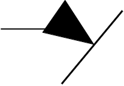

# mxGraph Integration

The [mxGraph](https://jgraph.github.io/mxgraph/) integration is in charge of displaying the BPMN diagrams, by filling the
[mxGraph model](https://jgraph.github.io/mxgraph/docs/manual.html#3.1.1) from the BPMN model.

If you are new to `mxGraph` or want to know more about it, please have a look at the [mxGraph tutorial](https://jgraph.github.io/mxgraph/docs/tutorial.html)
and [mxGraph manual](https://jgraph.github.io/mxgraph/docs/manual.html).

## Logical Groups of BPMN Elements

[mxGraph Group Structure](https://jgraph.github.io/mxgraph/docs/manual.html#3.1.4) allows to define a parent-child relationship
that leverages various rendering features like collapsing/expanding, layering, drill down, group move/hide, ...
See [mxGraph Complexity Management](https://jgraph.github.io/mxgraph/docs/manual.html#3.1.5) for more details.

On `mxGraph` graph creation, the `bpmn-visualization` fills the following group of BPMN elements:
- `pool` is the parent of `lanes` and `inter-lane elements` (for instance, `sequence flows`), or any BPMN elements when there is no `lane`
- `lane` is the parent of elements it includes in the BPMN source

The default mxGraph parent is the parent of

* inter pool elements (for instance, `message flows`)
* elements when the BPMN source doesn't define any lane/pool

## BPMN elements positioning

*Note*: the following applies to both BPMN shapes and edges (including waypoints)

The bpmn input source coordinates are absolute whereas mxgraph uses coordinates in the referential of the parent cell.
As we define a parent-child relationship when inserting BPMN elements in the mxGraph model, a coordinate transformation
layer is required. See [BpmnRenderer](../../src/component/mxgraph/BpmnRenderer.ts) for more details.

## BPMN Elements rendering and style

Each BPMN Element is transformed into a `mxGraph` [mxCell](https://jgraph.github.io/mxgraph/docs/manual.html#3.1.3.4) and then inserted into the `mxGraph` model:
- `vertex` for BPMN Shapes
- `edge` for BPMN Edges

At insertion, a style is passed to configure how the BPMN Element is rendered.

The [style](https://jgraph.github.io/mxgraph/docs/js-api/files/view/mxStylesheet-js.html) (see also the [mxGraph manual](https://jgraph.github.io/mxgraph/docs/manual.html#3.1.3.1))
is defined and registered in `StyleConfigurator`. In particular, it refers to the name of a [mxShape](https://jgraph.github.io/mxgraph/docs/js-api/files/shape/mxShape-js.html)
used for the rendering.

The `mxShape` can be a standard `mxGraph` class or a custom BPMN `mxShape` defined by the `bpmn-visualization`. The custom `mxShapes` are registered by [ShapeConfigurator](../../src/component/mxgraph/config/ShapeConfigurator.ts).
which associates the `mxShape` name (used in style definition) with the `mxShape` class to be used.

For more details, see [BPMN Support - How To](./bpmn-support-how-to.md).

### Resources

#### mxGraph

[mxgraph Geometry](https://jgraph.github.io/mxgraph/docs/manual.html#3.1.3.2)
> The coordinate system in JavaScript is x is positive to the right and y is positive
> downwards, and in terms of the graph, the positioning is absolute to the container
> within which the mxGraph is placed.

[mxgraph Group Structure](https://jgraph.github.io/mxgraph/docs/manual.html#3.1.4)
> The x,y position of a vertex is its position relative to its parent, so in the case of
> default grouping (all cells sharing the default parent) the cell positioning is also
> the absolute co-ordinates on the graph component.

#### BPMN specification

BPMNPlane (page 371)
> BPMNPlane element is always owned by a BPMNDiagram and represents the root diagram element of that diagram.
> The plane represents a 2 dimensional surface with an origin at (0, 0) along the x and y axes with increasing coordinates
> to the right and bottom. Only positive coordinates are allowed for diagram elements that are nested in a BPMNPlane.

BPMNShape (page 372)
> All BPMNShape elements are owned directly by a BPMNPlane (that is the root element in a BPMNDiagram), i.e., shapes
> are not nested within each other in the BPMN DI model although they may appear that way when depicted. The bounds
> of a BPMNShape are always relative to that plane’s origin point and are REQUIRED to be positive coordinates. Note that
> the bounds’ x and y coordinates are the position of the upper left corner of the shape (relative to the upper left corner of
> the plane).

BPMNEdge (page 375)
> All BPMNEdge elements are owned directly by a BPMNPlane (that is the root element in a BPMNDiagram). The
> waypoints of BPMNEdge are always relative to that plane’s origin point and are REQUIRED to be positive coordinates.

BPMNLabel (page 377)
> The bounds of BPMNLabel are always relative to the containing plane’s origin point. Note that the bounds’ x and y
> coordinates are the position of the upper left corner of the label (relative to the upper left corner of the plane).

## Label Font and Bounds

The `mxGraph` integration renders labels based on the definition taken from the BPMN source. When the label style is not
or only partially defined in BPMN, the following fallback takes place:
- for labels without a font, the rendering may not be accurate: the default font used by the original modeler may differ
from the one the `bpmn-visualization` uses. As a result, the bounds set in the BPMN file may be too small or large for the `bpmn-visualization` font. So the
resulting text wrapping cannot be the same as with the original modeler.
- for labels without bounds, the `bpmn-visualization` uses an arbitrary position which depends on the type of the BPMN element (for instance, middle
centred for tasks or on the bottom for start events). As for fonts, this does not cover all use cases, but works most of
the time.

### Shape

The `mxGraph` integration uses the following to set the label bounds
- the `vertex mxCell` geometry offset, see [mxGeometry](https://github.com/jgraph/mxgraph/blob/v4.2.2/javascript/src/js/model/mxGeometry.js#L60-L66)
for more details
  - x and y position relative to the shape `vertex` itself
  - as for the  shape `vertex` position, a coordinate transformation layer is required.
- styling for the label width (for word wrapping)

### Edge

#### Overview

The mxGraph integration uses the `edge mxCell` geometry to set the label bounds
- absolute geometry
- offset x and y: position related to the center of the edge and as for the Shape Position, a coordinate transformation layer is required.
  - the center depends on the 2 terminal waypoints
  - if the waypoints are not available, no position is set and the label is placed on the edge center
- width and height: for word wrapping.

see [mxGeometry](https://github.com/jgraph/mxgraph/blob/v4.2.2/javascript/src/js/model/mxGeometry.js#L60)

#### mxGraph Details

The label position is related to the 'center' of the edge, see [mxGeometry](https://github.com/jgraph/mxgraph/blob/v4.2.2/javascript/src/js/model/mxGeometry.js#L35)
for more details. The definition of 'center' differs whether the `mxGeometry` is `relative` or not:
- if relative, it is the center along the line
- if absolute, it is derived from the terminal points

This is explained in [mxGraphView.updateEdgeLabelOffset](https://github.com/jgraph/mxgraph/blob/v4.2.2/javascript/src/js/view/mxGraphView.js#L2187)
- center between the two endpoints if the geometry is absolute
- the relative distance between the center along the line, and the absolute orthogonal distance if the geometry is relative.

Check the [GitHub Pull Request #291](https://github.com/process-analytics/bpmn-visualization-js/pull/291#issuecomment-642024601)
to see various positioning methods in action.

#### Terminal Points and Perimeters

**Note**: All SVG files from this paragraph are generated from this [draw.io file](resources/mxGraph-perimeter.drawio).

##### Information from mxGrapĥ/maxGraph

`mxGraph` doesn't provide details about the Perimeters concept in the documentation. However, it is available in the `maxGraph` documentation about the [Perimeters](https://maxgraph.github.io/maxGraph/docs/usage/perimeters).

Here are some tips to switch from `maxGraph` to `mxGraph` concepts.

The definition of the cell style is not the same in `mxGraph` and `maxGraph`. In `mxGraph`, the style is a string, whereas in `maxGraph`, it is an object.
See the ["`mxGraph` to `maxGraph` migration guide" style paragraph](https://maxgraph.github.io/maxGraph/docs/usage/migrate-from-mxgraph/#styling) for more details.

For example, about the orthogonal projection activation:
- `mxGraph`: style[mxgraph.mxConstants.STYLE_ORTHOGONAL] = 1;
- `maxGraph`: style.orthogonal = true;

All `mxGraph` examples are listed in: https://jgraph.github.io/mxgraph/javascript/examples/index.html.
In particular, the Orthogonal example is available at https://jgraph.github.io/mxgraph/javascript/examples/orthogonal.html.

##### Perimeters in `bpmn-visualization`

We always set a perimeter to the style of the shapes we configure. This is done in [StyleConfigurator](../../src/component/mxgraph/config/StyleConfigurator.ts).

`mxGraph` provides various perimeters out of the box, in particular: rectangle, ellipse, diamond. This is everything we need for BPMN shapes, so we don't need to implement custom perimeters.

We don't use orthogonal projection in bpmn-visualization because it introduced side effects in the past. For more information, see:
- https://github.com/process-analytics/bpmn-visualization-js/issues/349
- https://github.com/process-analytics/bpmn-visualization-js/issues/295
- https://github.com/process-analytics/bpmn-visualization-js/issues/295#issuecomment-904336449
- https://github.com/process-analytics/bpmn-visualization-js/pull/1399

To ensure that the rendering matches our needs, we have a lot of non regression visual tests on associations, message and sequence flows for:
- edges without waypoints
- edges with some waypoints producing simple or complex paths
- terminal waypoints inside and outside shapes
- terminal waypoints outside shapes without intersection of the flow segment with the shape

###### Perimeter Impact on Edges and Markers

In BPMN source, most BPMN edges include waypoints, which the BPMN specification strongly recommends.
Some modelers don't set the terminal points on the visual perimeter of the shapes, causing side effects on the last segment of the edge and its markers when using `mxGraph` perimeters:
  1. **Final Waypoint Inside Shape**: An arrow may be displayed inside the terminal element ([#715](https://github.com/process-analytics/bpmn-visualization-js/issues/715)).
  2. **Marker Misalignment With Original Last Edge Segment**: A new segment is created to connect the edge to the shape perimeter. This new segment is not always aligned with the original segment, which creates a visual glitch like in the following screenshots 👇

| Positioning                                              | Rendering                                              |
|----------------------------------------------------------|--------------------------------------------------------|
|  |  |

###### Workaround used to Fix the Problem

The current implementation was done in [PR #1868](https://github.com/process-analytics/bpmn-visualization-js/pull/1868).
It solves the previous problem by
- Ignoring perimeters if the edges have waypoints.
- Using the perimeters only if the edge has no waypoints.

This logic is implemented in `BpmnGraphView` (extends `mxGraphView`), overriding `getFloatingPoint`:
- With waypoints: Ignore the perimeter. Use the first and the last non-null value in the `points` array as endpoint.
- Without waypoints: Use perimeter calculation.

**Reminder about `mxGraph` terminal waypoints**

The points of the cell in the model are copied into the `abspoints` array property of the edge `state` instance, starting and ending with `null`. 
They will later be replaced by the computed terminal points in [`mxGraphView.updateFloatingTerminalPoints`](https://github.com/jgraph/mxgraph/blob/v4.2.2/javascript/src/js/view/mxGraphView.js#L1547) which involves the perimeter if it is defined.

⚠️ So, if the edge has no waypoints, the array will contain 2 `null' values.

**Limitations of the current implementation**

Edges may appear too short, because no additional points are calculated on the perimeter of the target shape.

The screenshots below illustrate the problem and the effect of using a perimeter. The edges have no `EdgeStyle` (`STYLE_EDGE` is not set). 
These images are from [PR #1765](https://github.com/process-analytics/bpmn-visualization-js/pull/1765#issuecomment-1018508771) (2 screenshots at the end) and show the test diagram `flows.sequence.04.waypoints.03.terminal.outside.shapes.02.segments.no.intersection.with.shapes.bpmn`.

| Without Projection (no perimeter)                                                                                                                       | Default (Projection to center)                                                                                                                                                  | Orthogonal Projection (`STYLE_ORTHOGONAL` = 1)                                                                                                                           |
|---------------------------------------------------------------------------------------------------------------------------------------------------------|---------------------------------------------------------------------------------------------------------------------------------------------------------------------------------|--------------------------------------------------------------------------------------------------------------------------------------------------------------------------|
|  |  |  |

###### Potential future enhancements

Align edges by extending them to intersect with the shape perimeter instead of adding a misaligned segment.

- **Intersect with Perimeter**: Calculate the edge endpoint to meet the shape perimeter, preventing alignment issues.  
- **Fallback to `mxGraph` Perimeter**: If no intersection is found, default to `mxGraph`'s perimeter behavior.  

| **Edge Markers: Projection vs Intersection** | **Perimeter Usage When No Intersection** |  
|-------------------------------|------------------------------|  
|  |  |  

**Potential fixes**

This solution would make it possible to implement the following points:
- ["Ensure that the terminal waypoints are on the shape perimeter"](https://github.com/process-analytics/bpmn-visualization-js/issues/1870)
- ["Restore the experimental pools/subprocess live collapsing"](https://github.com/process-analytics/bpmn-visualization-js/issues/1871)

**Additional considerations**

- **Foreground/Background Positioning**: `mxGraph` supports foreground/background positioning ([PR #1863](https://github.com/process-analytics/bpmn-visualization-js/pull/1863), [Issue #1870](https://github.com/process-analytics/bpmn-visualization-js/issues/1870)). [bpmn-js](https://github.com/bpmn-io/bpmn-js/) places shapes in the foreground and edges in the background.  
- **SVG Q (quadratic)**: Enabling `rounded` in the edge style caused an overlay misalignment at the edge center due to `mxPolyline.paintLine`. See `mxShape.addPoints` for details ([PR #1207](https://github.com/process-analytics/bpmn-visualization-js/pull/1207#issuecomment-810357733)).
- **Intersection Detection**: The [path-intersection](https://github.com/bpmn-io/path-intersection) library could be useful for handling edge intersections.

## Overlays

We are hacking mxCellOverlays which originally only supports image shape. This lets us use custom shapes.

Customization main points
- [MxGraphCustomOverlay](../../src/component/mxgraph/overlay/custom-overlay.ts): add extra configuration and behavior to `mxCellOverlay`.
- [BpmnCellRenderer](../../src/component/mxgraph/BpmnCellRenderer.ts) (customized `mxCellRenderer`): change the overlays rendering code to transform `MxGraphCustomOverlay` into specific shapes 
according to its configuration.

More details are available in [#955](https://github.com/process-analytics/bpmn-visualization-js/issues/955).

## Custom CSS classes added to SVG node generated by mxGraph

In [BpmnCellRenderer](../../src/component/mxgraph/BpmnCellRenderer.ts), we customize the `mxShape` rendering code to add extra CSS classes depending on BPMN Element kinds.
It allows styling to be managed with external CSS classes, and it is also used for element identification and selection.

More details are available in [#942](https://github.com/process-analytics/bpmn-visualization-js/issues/942).
