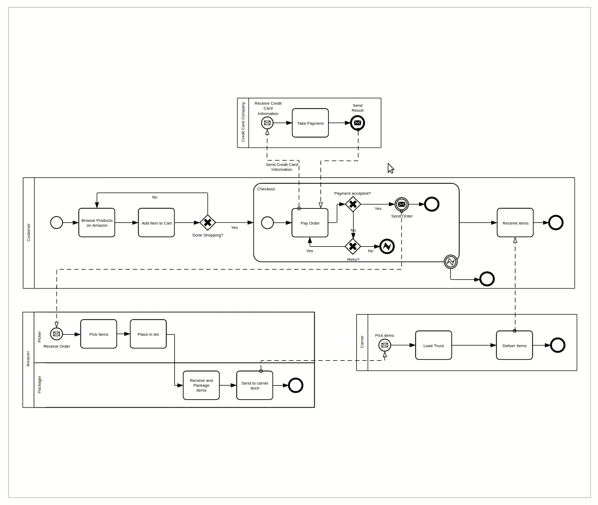

== Overview
:favicon:

=== Live Examples

To see `bpmn-visualization` in action, give a try to the https://cdn.statically.io/gh/process-analytics/bpmn-visualization-examples/master/examples/index.html[**icon:forward[] examples live environment**]
you will quickly have an overview of the `bpmn-visualization` capabilities.

=== Usage

`bpmn-visualization` can be directly used in HTML pages or integrated in Javascript and TypeScript application. It is distributed as https://npmjs.org/package/bpmn-visualization:[npm package]
through various bundle formats.

The API documentation is provided directly in the package thanks to the TypeScript declaration files that are used by IDE for code assist.

For more technical details and how-to, go to the https://github.com/process-analytics/bpmn-visualization-examples/[bpmn-visualization-examples]
repository.

=== BPMN Diagrams

https://www.omg.org/spec/BPMN/2.0.2/[BPMN diagrams] are at the foundation of the `bpmn-visualization` capabilities.

Go to <<supported-bpmn-elements, Supported BPMN Elements>> section to better now what is the current BPMN support.

==== Diagram Display

The first goal of `bpmn-visualization` is to display BPMN diagram but this is up to the integration (i.e. the application that uses it) to provide the BPMN diagram
content.  +
For instance, it can be retrieved from a local device, after pulling a REST API, it can be available after a push from websockets or SSE, ...

Once the integration get the BPMN diagram input source (a xml string), it just has to pass it to `bpmn-visualization` which is then in charge of rendering the diagram.

==== Diagram Navigation

*TODO improve see how diagraming lib explains that*

bpmn-js
Being able to efficiently navigate through bigger diagrams has always been an important concern for us. This release makes scrolling the default diagram interaction and exposes zooming via CTRL + wheel.
we now mirror the navigation pattern known from most browsers and desktop applications. This allows even more intuitive diagram navigation, no matter where a diagram is embedded.

In addition to BPMN diagram rendering, `bpmn-visualization` provides various way to let you discover and navigate the diagram 

* zoom
* fit: reset/set the zoom level and eventually translate the diagram (for instance, center the diagram). This can be done at load time or at any time.
* panning: drag the diagram and move/translate it

==== Diagram Display and Navigation in Action

*TODO explain what we do here*

_Navigation with the https://github.com/bpmn-miwg/bpmn-miwg-test-suite/blob/cc75e467fd2b3009e67d4b24943591c66ce91a23/Reference/C.2.0.bpmn[migw-test-suite C.2.0] BPMN diagram_
