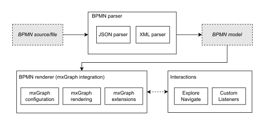

=== Architecture Overview

`bpmn-visualization` consists on 3 main modules:

* the *BPMN parser*: read a BPMN source (xml string) and convert it into its own <<bpmn-internal-model,internal Model>>.
* the *BPMN renderer*: display the BPMN diagrams represented by the internal Model, using the https://jgraph.github.io/mxgraph/[mxGraph library]
* the *interactions component*: interact with the BPMN elements (diagram navigation, add custom listeners to dynamically enrich and/or modify the model style, ...)

