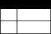
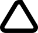
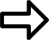
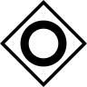
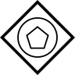
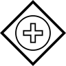

[[supported-bpmn-elements]]
= Supported BPMN Elements
:icons: font
ifdef::env-github[]
:tip-caption: :bulb:
:note-caption: :information_source:
:important-caption: :heavy_exclamation_mark:
:caution-caption: :fire:
:warning-caption: :warning:
endif::[]

NOTE: The BPMN support roadmap is available in https://github.com/process-analytics/bpmn-visualization-js/milestones[GitHub milestones]

The following presents BPMN elements that can be rendered by the `bpmn-visualization` and states which is their rendering status i.e. if
the BPMN elements are rendered with their final shapes.

[TIP]
.Legend for rendering status
====
* icon:check-circle[] considered as stable (only minor changes may occur)
* icon:check-circle-o[] early access (1st attempt)
* icon:flask[] experimental (subject to change)
* no status means that are arbitrary rendering is used (i.e. not following the BPMN specification requirements), generally using a dedicated color to identify the shape among others
====

== Containers

[cols="1,1,4a", options="header"]
.Containers
|===
.^|Name
^.^|Rendering
.^|Comments

.^|Lane
^.^|icon:check-circle-o[]
.^|Sub lanes are also supported

.^|Pool
^.^|icon:check-circle-o[]
.^|
|===

== Activities

[cols="1,1,1,4", options="header"]
.Activities
|===
.^|Name
^.^|Rendering
^.^|Icon
.^|Comments

.^|Abstract Task
^.^|icon:check-circle[]
^.^|
.^|

.^|Business Rule Task
^.^|icon:check-circle-o[]
^.^|
.^|

.^|Manual Task
^.^|icon:check-circle-o[]
^.^|image:images/icons/task_manual.svg[Manual rule icon,30]
.^|Icon may be subject to change+
*icon*: the task icon is derived from the https://thenounproject.com/term/hand/7660/[noun project 'hand' icon] by João Miranda, licensed as https://creativecommons.org/licenses/by/3.0/us/legalcode[Creative Commons CCBY 3.0]

.^|Receive Task
^.^|icon:check-circle-o[]
^.^|
.^|Icon may be subject to change

.^|Script Task
^.^|icon:check-circle-o[]
^.^|
.^|Icon may be subject to change +
*icon*: the task icon is derived from the https://thenounproject.com/term/script/2331578/[noun project 'script' icon] by Sérgio Filipe Cardoso Pires, licensed as https://creativecommons.org/licenses/by/3.0/us/legalcode[Creative Commons CCBY 3.0]

.^|Send Task
^.^|icon:check-circle-o[]
^.^|
.^|Icon may be subject to change

.^|Service Task
^.^|icon:check-circle-o[]
^.^|
.^|Icon may be subject to change +
*icon*: the task icon is derived from the https://github.com/jgraph/drawio/blob/9394fb0f1430d2c869865827b2bbef5639f63478/src/main/webapp/stencils/bpmn.xml#L898[draw.io bpmn mxgraph stencil]

.^|User Task
^.^|icon:check-circle-o[]
^.^|
.^|Icon may be subject to change +
*icon*: the task icon is derived from the https://www.flaticon.com/free-icon/employees_554768[flaticon 'employees' icon] "Icons made by https://www.flaticon.com/authors/freepik[freepik] from https://www.flaticon.com"

.^|Call Activity calling a Process
^.^|icon:check-circle-o[]
^.^|
.^|

.^|Call Activity calling a Global Task
^.^|icon:check-circle-o[]
^.^|
.^|

.^|Call Activity calling a Global Business Rule Task
^.^|icon:check-circle-o[]
^.^|
.^|

.^|Call Activity calling a Global Manual Task
^.^|icon:check-circle-o[]
^.^|
.^|

.^|Call Activity calling a Global Script Task
^.^|icon:check-circle-o[]
^.^|
.^|

.^|Call Activity calling a Global User Task
^.^|icon:check-circle-o[]
^.^|
.^|

.^|Embedded Sub-Process
^.^|icon:check-circle-o[]
^.^|
.^|

.^|Event Sub-Process
^.^|icon:check-circle-o[]
^.^|
.^|Collapsed sub-process : + 
- Missing start event icon
|===

[cols="1,1,1,4", options="header"]
.Markers
|===
.^|Name
^.^|Rendering
^.^|Icon
.^|Comments

.^|Loop Marker
^.^|icon:check-circle-o[]
^.^|
.^|The icon is derived from the https://github.com/jgraph/drawio/blob/9394fb0f1430d2c869865827b2bbef5639f63478/src/main/webapp/stencils/bpmn.xml#L543[loop] of draw.io

.^|Sequential Multi-Instance Marker
^.^|icon:check-circle-o[]
^.^|
.^|

.^|Parallel Multi-Instance Marker
^.^|icon:check-circle-o[]
^.^|
.^|
|===

*Notes about markers*

- The size of the marker icons will be set to a fixed size later
- The marker icon of the collapsed activities may be subject to change

== Events

The event definition can be defined on the event or on the definitions.

*Note*: the following events use icons derived from existing solutions

* link: https://www.flaticon.com/free-icon/right-arrow_222330[Right arrow] "Icons made by https://www.flaticon.com/authors/freepik[Freepik] from https://www.flaticon.com"
* message: https://github.com/jgraph/drawio/blob/0e19be6b42755790a749af30450c78c0d83be765/src/main/webapp/shapes/bpmn/mxBpmnShape2.js#L465[draw.io bpmn mxgraph stencil]
* signal: https://thenounproject.com/term/triangle/2452089/[triangle] By https://thenounproject.com/imamdji99[Imam], ID from https://thenounproject.com 
* timer: https://www.flaticon.com/free-icon/clock_223404[Timer Icon] "Icons made by https://www.flaticon.com/authors/kirill-kazachek[Kirill Kazachek] from https://www.flaticon.com"

[cols="1,1,1,4", options="header"]
.Start Events
|===
.^|Name
^.^|Rendering
^.^|Icon
.^|Comments

.^|None Start Event
^.^|icon:check-circle[]
^.^|
.^|

.^|Conditional Start Event
^.^|icon:check-circle-o[]
^.^|
.^|The stroke & icon width may be adjusted

.^|Message Start Event
^.^|icon:check-circle-o[]
^.^|
.^|The stroke & icon width may be adjusted

.^|Signal Start Event
^.^|icon:check-circle-o[]
^.^|
.^|The stroke & icon width may be adjusted

.^|Timer Start Event
^.^|icon:check-circle-o[]
^.^|
.^|The icon width may be adjusted
|===

[cols="1,1,1,4", options="header"]
.Event Sub-Process Interrupting Start Events
|===
.^|Name
^.^|Rendering
^.^|Icon
.^|Comments

.^|Compensation Interrupting Start Event
^.^|icon:check-circle-o[]
^.^|
.^|The stroke & icon width may be adjusted

.^|Conditional Interrupting Start Event
^.^|icon:check-circle-o[]
^.^|
.^|The stroke & icon width may be adjusted

.^|Error Interrupting Start Event
^.^|icon:check-circle-o[]
^.^|image:images/icons/event_start_boundary_error.svg[Error icon,30]
.^|The stroke & icon width may be adjusted

.^|Escalation Interrupting Start Event
^.^|icon:check-circle-o[]
^.^|
.^|The stroke & icon width may be adjusted

.^|Message Interrupting Start Event
^.^|icon:check-circle-o[]
^.^|
.^|The stroke & icon width may be adjusted

.^|Signal Interrupting Start Event
^.^|icon:check-circle-o[]
^.^|
.^|The stroke & icon width may be adjusted

.^|Timer Interrupting Start Event
^.^|icon:check-circle-o[]
^.^|
.^|The icon width may be adjusted
|===

[cols="1,1,1,4", options="header"]
.Event Sub-Process Non-Interrupting Start Events
|===
.^|Name
^.^|Rendering
^.^|Icon
.^|Comments

.^|Conditional Non-interrupting Start Event
^.^|icon:check-circle-o[]
^.^|
.^|The stroke & icon width may be adjusted

.^|Escalation Non-interrupting Start Event
^.^|icon:check-circle-o[]
^.^|
.^|The stroke & icon width may be adjusted

.^|Message Non-interrupting Start Event
^.^|icon:check-circle-o[]
^.^|
.^|The stroke & icon width may be adjusted

.^|Signal Non-interrupting Start Event
^.^|icon:check-circle-o[]
^.^|
.^|The stroke & icon width may be adjusted

.^|Timer Non-interrupting Start Event
^.^|icon:check-circle-o[]
^.^|
.^|The icon width may be adjusted
|===

[cols="1,1,1,4", options="header"]
.Intermediate Catch Events
|===
.^|Name
^.^|Rendering
^.^|Icon
.^|Comments

.^|Conditional Intermediate Catch Event
^.^|icon:check-circle-o[]
^.^|
.^|The stroke & icon width may be adjusted

.^|Link Intermediate Catch Event
^.^|icon:check-circle-o[]
^.^|
.^|The stroke & icon width may be adjusted

.^|Message Intermediate Catch Event
^.^|icon:check-circle-o[]
^.^|
.^|The stroke & icon width may be adjusted

.^|Signal Intermediate Catch Event
^.^|icon:check-circle-o[]
^.^|
.^|The stroke & icon width may be adjusted

.^|Timer Intermediate Catch Event
^.^|icon:check-circle-o[]
^.^|
.^|The icon width may be adjusted
|===

[cols="1,1,1,4", options="header"]
.Intermediate Throw Events
|===
.^|Name
^.^|Rendering
^.^|Icon
.^|Comments

.^|None Intermediate Throw Event
^.^|icon:check-circle-o[]
^.^|
.^|The stroke width may be adjusted

.^|Compensation Intermediate Throw Event
^.^|icon:check-circle-o[]
^.^|
.^|The stroke & icon width may be adjusted

.^|Escalation Intermediate Throw Event
^.^|icon:check-circle-o[]
^.^|
.^|The stroke & icon width may be adjusted

.^|Link Intermediate Throw Event
^.^|icon:check-circle-o[]
^.^|
.^|The stroke & icon width may be adjusted

.^|Message Intermediate Throw Event
^.^|icon:check-circle-o[]
^.^|
.^|The stroke & icon width may be adjusted

.^|Signal Intermediate Throw Event
^.^|icon:check-circle-o[]
^.^|
.^|The stroke & icon width may be adjusted
|===

[cols="1,1,1,4", options="header"]
.Interrupting Boundary Events
|===
.^|Name
^.^|Rendering
^.^|Icon
.^|Comments

.^|Cancel Interrupting Boundary Event
^.^|icon:check-circle-o[]
^.^|
.^|The stroke & icon width may be adjusted

.^|Compensation Interrupting Boundary Event
^.^|icon:check-circle-o[]
^.^|
.^|The stroke & icon width may be adjusted

.^|Conditional Interrupting Boundary Event
^.^|icon:check-circle-o[]
^.^|
.^|The stroke & icon width may be adjusted

.^|Error Interrupting Boundary Event
^.^|icon:check-circle-o[]
^.^|image:images/icons/event_start_boundary_error.svg[Error icon,30]
.^|The stroke & icon width may be adjusted

.^|Escalation Interrupting Boundary Event
^.^|icon:check-circle-o[]
^.^|
.^|The stroke & icon width may be adjusted

.^|Message Interrupting Boundary Event
^.^|icon:check-circle-o[]
^.^|
.^|The stroke & icon width may be adjusted

.^|Signal Interrupting Boundary Event
^.^|icon:check-circle-o[]
^.^|
.^|The stroke & icon width may be adjusted

.^|Timer Interrupting Boundary Event
^.^|icon:check-circle-o[]
^.^|
.^|The stroke & icon width may be adjusted
|===

[cols="1,1,1,4", options="header"]
.Non-interrupting Boundary Events
|===
.^|Name
^.^|Rendering
^.^|Icon
.^|Comments

.^|Conditional Non-interrupting Boundary Event
^.^|icon:check-circle-o[]
^.^|
.^|The stroke & icon width may be adjusted

.^|Escalation Non-interrupting Boundary Event
^.^|icon:check-circle-o[]
^.^|
.^|The stroke & icon width may be adjusted

.^|Message Non-interrupting Boundary Event
^.^|icon:check-circle-o[]
^.^|
.^|The stroke & icon width may be adjusted

.^|Signal Non-interrupting Boundary Event
^.^|icon:check-circle-o[]
^.^|
.^|The stroke & icon width may be adjusted

.^|Timer Non-interrupting Boundary Event
^.^|icon:check-circle-o[]
^.^|
.^|The stroke & icon width may be adjusted
|===

[cols="1,1,1,4", options="header"]
.End Events
|===
.^|Name
^.^|Rendering
^.^|Icon
.^|Comments

.^|None End Event
^.^|icon:check-circle-o[]
^.^|
.^|The stroke width may be adjusted

.^|Cancel End Event
^.^|icon:check-circle-o[]
^.^|
.^|The icon width may be adjusted

.^|Compensation End Event
^.^|icon:check-circle-o[]
^.^|
.^|The icon width may be adjusted

.^|Error End Event
^.^|icon:check-circle-o[]
^.^|
.^|The icon width may be adjusted

.^|Escalation End Event
^.^|icon:check-circle-o[]
^.^|
.^|The icon width may be adjusted

.^|Message End Event
^.^|icon:check-circle-o[]
^.^|
.^|The stroke & icon width may be adjusted

.^|Signal End Event
^.^|icon:check-circle-o[]
^.^|
.^|The stroke & icon width may be adjusted

.^|Terminate End Event
^.^|icon:check-circle-o[]
^.^|
.^|The stroke width may be adjusted
|===

== Flows

[cols="1,1,4a", options="header"]
.Flows
|===
.^|Name
^.^|Rendering
.^|Comments

.^|Sequence Flow
^.^|icon:check-circle-o[]
.^|Subject to change: arrow size/form and position endpoint

.^|Default Sequence Flow
^.^|icon:check-circle-o[]
.^|Subject to change: arrow size/form and position endpoint +
*marker* is derived from https://github.com/jgraph/drawio/blob/f539f1ff362e76127dcc7e68b5a9d83dd7d4965c/src/main/webapp/js/mxgraph/Shapes.js#L2796[dash marker] of draw.io

.^|Conditional Sequence Flow
^.^|icon:check-circle-o[]
|Subject to change: arrow size/form and position endpoint

.^|Message Flow
^.^|icon:check-circle-o[]
.^|- No message: Subject to change: arrow size/form and position endpoint +
- Initiating message: To do
- Non-initiating message: To do

.^|Way Points
^.^|icon:flask[]
.^|Subject to change: paths may be rounded
|===

== Gateways

[cols="1,1,1,4", options="header"]
.Gateways
|===
.^|Name
^.^|Rendering
^.^|Icon
.^|Comments

.^|Exclusive
^.^|icon:check-circle-o[]
^.^|
.^|Icon may be subject to change +

.^|Inclusive
^.^|icon:check-circle-o[]
^.^|
.^|Icon may be subject to change +

.^|Parallel
^.^|icon:check-circle-o[]
^.^|
.^|Icon may be subject to change +

.^|Event-Based
^.^|icon:check-circle-o[]
^.^|  
.^|Support the `event gateway type` (Exclusive and Parallel) and the `instantiate` status

.^|Complex
^.^|icon:check-circle-o[]
^.^|
.^|
|===

== Labels

[cols="1,1,4", options="header"]
.Labels
|===
.^|Name
^.^|Rendering
.^|Comments

.^|Shape Label
^.^|icon:check-circle-o[]
.^|

.^|Edge Label
^.^|icon:check-circle-o[]
.^|
|===

== Artifacts

[cols="1,1,4", options="header"]
.Artifacts
|===
.^|Name
^.^|Rendering
.^|Comments

.^|Group
^.^|icon:check-circle[]
.^|

.^|Text Annotation
^.^|icon:check-circle-o[]
.^|
|===

== Associations

[cols="1,1,4", options="header"]
.Associations
|===
.^|Name
^.^|Rendering
.^|Comments
.^|Text Annotation Association
^.^|icon:check-circle-o[]
.^|All three directional associations are supported: None, One, Both
|===
