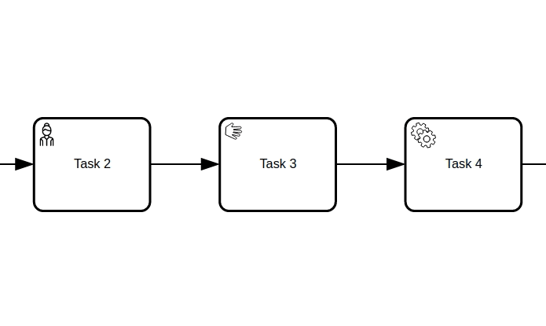

== Overview
:icons: font

=== Live Examples

To see `bpmn-visualization` in action, give a try to the https://cdn.statically.io/gh/process-analytics/bpmn-visualization-examples/master/examples/index.html[**icon:forward[] examples live environment**]. +
You will quickly have an overview of the `bpmn-visualization` capabilities.

=== Usage

==== Bundles
`bpmn-visualization` can be directly used in HTML pages or integrated in Javascript and TypeScript applications. It is distributed as a https://npmjs.org/package/bpmn-visualization[npm package]
in various bundle formats.

==== API
The API documentation is provided directly in the package thanks to the TypeScript declaration files that can be used in IDE for code assist. +
There is also an HTML version which is available in the link:./api/index.html[API HTML documentation, window="_blank"].

==== More technical details
For more technical details and how-to, go to the https://github.com/process-analytics/bpmn-visualization-examples/[bpmn-visualization-examples]
repository.

=== Glossary

Here are a list of terms and concepts we are using in the `bpmn-visualization` documentation, issues, examples...

[cols="3,7", options="header"]
.Glossary
|===
|Term or concept
|Description

|BPMN rendering
|The part of the rendering that concerns purely the BPMN model according to the specification

|Customization
|The library user changes the rendering / behavior using their own code by extending the library

|Configuration
|The library user changes the rendering / behavior using existing features

|Custom behavior
|Any behavior that causes changes in the BPMN rendering (adding popup, changing elements color or thickness...)

|Diagram navigation
|Set of user interactions, that permits pan and zoom, to achieve desired visibility on diagram elements or diagram as a whole

|Options
|Configuration elements used at the library initialization and by the APIs at runtime

|Library integration
|Something about how an app can integrate the library

|Process data
|Execution data + derived data

|Execution data
|Data that is generated during the natural process instance flow: state, logs, ...

|Derived data
|Data that by any means derives from the execution data and/or other contextual data

|===

=== BPMN Diagrams

https://www.omg.org/spec/BPMN/2.0.2/[BPMN diagrams] are at the foundation of the `bpmn-visualization` capabilities.

Go to <<supported-bpmn-elements, Supported BPMN Elements>> section to better now what is the current BPMN support.

==== BPMN rendering

The first goal of `bpmn-visualization` is to render BPMN diagrams but this is up to the integration (i.e. the application that uses it) to provide the BPMN diagram
content.  +
For instance, it can be retrieved from a local file, by pulling a REST API, made available after a push from websockets or SSE, ...

Once the integration gets the BPMN diagram input source, it just has to pass it to `bpmn-visualization` which is then in charge of rendering the diagram.

[[diagram-navigation]]
==== Diagram Navigation

In addition to BPMN rendering, `bpmn-visualization` provides several ways to explore and navigate through the BPMN diagrams.
This is made available at load time or at runtime, through user interactions or API calls.

The navigation features are:

* zoom: change the diagram scale to show details or have an overview of the diagram.
* fit: reset/set the zoom level and eventually translate the diagram (for instance, center the diagram).
* pan: drag the diagram and move/translate it, to hidden parts or change the position in the view.

Navigation is particularly useful for large diagrams. Fitting the view to the screen provides a good overview of a large diagram, but it can be hard to see details. +
You can zoom to highlight specific parts, then pan to view different diagram portions. +
After navigating around, you may want to reset the zoom level and go back to a full diagram overview.

==== BPMN rendering and Diagram Navigation in Action

image::images/bpmn-diagram_navigation_C.2.0.gif[BPMN Diagram Navigation]

_Navigation with the https://github.com/bpmn-miwg/bpmn-miwg-test-suite/blob/cc75e467fd2b3009e67d4b24943591c66ce91a23/Reference/C.2.0.bpmn[migw-test-suite C.2.0] BPMN diagram_

[#process_data]
=== Process data

`bpmn-visualization` gives you the opportunity to visualize the Process Data on top of the BPMN diagrams.
The purpose of the library is to gain the visibility on what happens in your processes.

Process Data consists of two main data sets:

* Execution Data - data that accompanies the process instance (case) through the execution flow. All the events occurring along this workflow, contractual data and every other bits of information related to this particular instance from start to the end.
* Derived Data - data that derives from the execution data: predictions, analysis, statistics. The other data that can be associated with the process instance can also be a part of this set.

==== Process data examples

The example of Process Data for different tasks can be as follows.

*_user task_*:

* time of the execution
* percentage of the time spent in this task in the scope of whole time to finish the process instance
* data related to list of activities done to complete this task:
** SAP data manipulations
** messaging system data
** Microsoft Excel entries (reporting)
** other proprietary systems data

*_service task_*:

* time of the execution
* data related to list of activities done to complete this task:
** RPA robot data
** external API call
** ...

=== Custom behavior

`bpmn-visualization` provides API to interact with the BPMN elements and their representation as DOM Element.

Fore more examples about `Custom Behavior`, see the https://cdn.statically.io/gh/process-analytics/bpmn-visualization-examples/master/examples/index.html[**icon:forward[] examples live environment**]

==== BPMN semantic and DOM Element

A BPMN element contains BPMN semantic information that can be matched with <<process_data>>. The DOM Element let you manipulate the representation and allow enriching its behavior
by adding https://developer.mozilla.org/en-US/docs/Web/API/EventListener[event listeners] for instance.

The following example demonstrates how to let users interact with a BPMN diagram when clicking on a task, passing the mouse over another task or a transition between two elements. +
Here, it displays BPMN information only, but it could use this feature to display execution data related to the current BPMN element:  execution time and details, pending user
of an activity, current error at this stage of the process, and more.

[.thumb]

_Display popovers on over or click_

==== Style

The style of BPMN elements can be modified at runtime allowing to mark, hide, change appearance of one or several specific elements. For instance, this feature can be used to mark
a task as in error, warn that an activity has been started for a while and seems stuck, ... 

This example shows how to see which path in a process is the current running activity.

[.thumb]
image::images/custom-behavior-path-highlighting.gif[]
_Path highlighting with the https://github.com/bpmn-miwg/bpmn-miwg-test-suite/blob/cc75e467fd2b3009e67d4b24943591c66ce91a23/Reference/C.1.1.bpmn[miwg-test-suite C.1.1] BPMN diagram_

=== Overlays

`bpmn-visualization` provides https://process-analytics.github.io/bpmn-visualization-js/api/classes/bpmnelementsregistry.html#addoverlays[API to add overlays] on top of BPMN elements. This additional overlays layer permits you to show whatever data you want and enrich your diagrams.

==== Overlays examples
To see overlays simple examples, go to the https://cdn.statically.io/gh/process-analytics/bpmn-visualization-examples/master/examples/index.html#overlays[**icon:forward[] Simple examples - live demo**] You will find out how to add overlays to BPMN elements and how to apply style to them.

For the more complete example, please go to https://cdn.statically.io/gh/process-analytics/bpmn-visualization-examples/master/demo/monitoring-all-process-instances/index.html[**icon:forward[] Monitoring of all process instances - live demo**]. This demo shows how to add execution time and frequency data on diagram elements.
